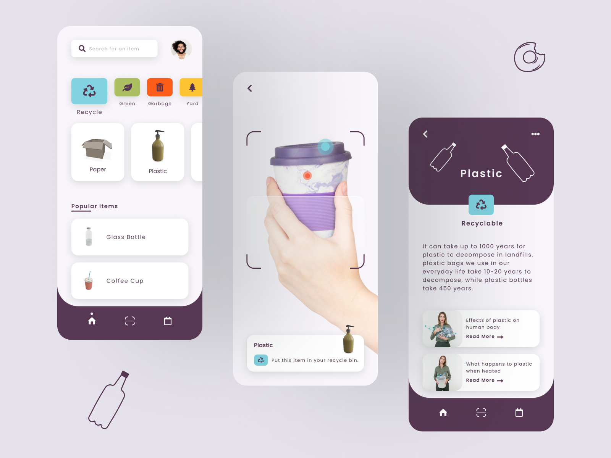
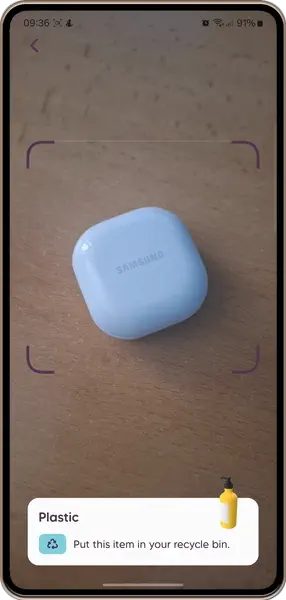

# Waste App

**.NET MAUI** implementation of [Waste App](https://dribbble.com/shots/14433671-Waste-App) design by [Sara Salehi](https://dribbble.com/SaraSalehi).

https://github.com/RadekVyM/Waste-App/assets/65116078/423cf52d-dccc-4b11-93b5-47d66acaa705

This project demonstrates how to create .NET MAUI apps with tailored UI using **C# only**.

## Original design

## Installation

First, make sure you have your Visual Studio and .NET 8 environment set up for .NET MAUI development. If not, follow the [setup instructions](https://learn.microsoft.com/dotnet/maui/get-started/installation). Then make sure you have your [Android](https://learn.microsoft.com/dotnet/maui/get-started/first-app?pivots=devices-android) or [iOS](https://learn.microsoft.com/dotnet/maui/get-started/first-app?pivots=devices-ios) platform set up for deployment of the application.

Once everything is set up, you can clone the repo and run the application via Visual Studio or Visual Studio Code.

Here are some resources to learn more about .NET MAUI:

- [Official website](https://dotnet.microsoft.com/apps/maui)
- [Microsoft Learn](https://learn.microsoft.com/dotnet/maui/what-is-maui)
- [.NET MAUI GitHub repository](https://github.com/dotnet/maui)

## Features

The app's UI is built with .NET MAUI APIs, [CommunityToolkit.Maui.Camera](https://github.com/CommunityToolkit/Maui) and my [SimpleToolkit](https://github.com/RadekVyM/SimpleToolkit) library. The [.NET MAUI Markup Community Toolkit](https://github.com/CommunityToolkit/Maui.Markup) and [Maui.BindableProperty.Generator](https://github.com/rrmanzano/maui-bindableproperty-generator) made building the UI using C# only much easier.

    
    &nbsp;&nbsp;
    

